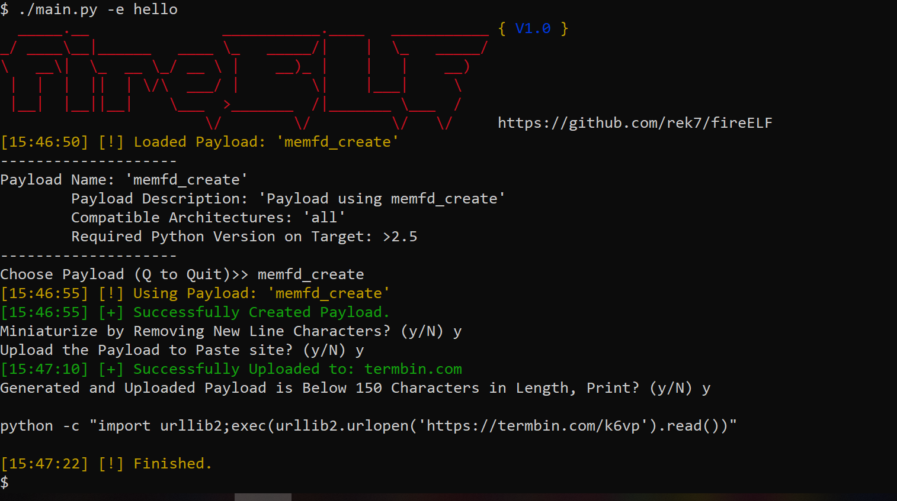

# fireELF
[](https://travis-ci.org/rek7/fireELF) [](https://github.com/rek7/fireELF/blob/master/LICENSE)

fireELF is a opensource fileless linux malware framework thats crossplatform and allows users to easily create and manage payloads. By default is comes with 'memfd_create' which is a new way to run linux elf executables completely from memory, without having the binary touch the harddrive.
## Screenshots


## Features
* Choose and build payloads
* Ability to minify payloads
* Ability to shorten payloads by uploading the payload source to a pastebin, it then creates a very small stager compatible with python <= 2.7 which allows for easy deployment
* Output created payload to file
* Ability to create payload from either a url or a local binary

## Included payload memfd_create
The only included payload 'memfd_create' is based on the research of [Stuart](https://magisterquis.github.io/2018/03/31/in-memory-only-elf-execution.html), this payload creates an anonymous file descriptor in memory it then uses fexecve to execute the binary directly from the file descriptor. This allows for the execution completely in memory which means that if the linux system gets restarted, the payload will be no where to be found.
## Creating a Payload
By default fireELF comes with 'memfd_create' but users can develop their own payloads. By default the payloads are stored in payloads/ and in order to create a valid payload you simply need to include a dictonary named 'desc' with the parameters 'name', 'description', 'archs', and 'python_vers'. An example desc dictonary is below:

```python
desc = {"name" : "test payload", "description" : "new memory injection or fileless elf payload", "archs" : "all", "python_vers" : ">2.5"}
```

In addition to the 'desc' dictonary the entry point the plugin engine i built uses requires a main function which will automatically get passed two parameters, one is a boolean that if its true it means its getting passed a url the second parameter it gets passed is the data. An example of a simple entry point is below:
```python
def main(is_url, url_or_payload):
    return
```
If you have a method feel free to commit a payload!
## Installation
Download the dependencies by running: 

```
pip3 -U -r dep.txt
```

fireELF is developed in [Python](http://www.python.org/download/) 3.x.x
## Usage
```
usage: main.py [-h] [-s] [-p PAYLOAD_NAME] [-w PAYLOAD_FILENAME]
               (-u PAYLOAD_URL | -e EXECUTABLE_PATH)

fireELF, Linux Fileless Malware Generator

optional arguments:
  -h, --help           show this help message and exit
  -s                   Supress Banner
  -p PAYLOAD_NAME      Name of Payload to Use
  -w PAYLOAD_FILENAME  Name of File to Write Payload to (Highly Recommended if
                       You're not Using the Paste Site Option)
  -u PAYLOAD_URL       Url of Payload to be Executed
  -e EXECUTABLE_PATH   Location of Executable
  ```